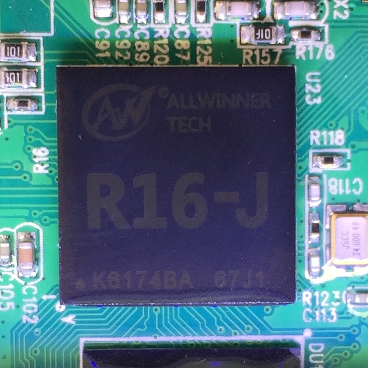

# Documents

Here you'll find all kind of documents relevant to the project

## Software related
* [Rooting the Conga 3x90](rooting-conga-3x90.md)
* [ADB without password](adb-without-password.md)
* [Capturing network traffic](capture-network-packets.md)
* [List of commands](robot-commands-list.md)

## Hardware related

### Mainboard
Main PCB board, model CRL200S-01-V006 made by 3iRobotix, with components and connection pins labeled: Conga models 3290, 3390, 3490, 3590, 3690 and 3790.

### Main CPU
AllWinnerTech A33/R16-J Armv7 CPU

* [Datasheet](R16_Datasheet_V1.4_(1).pdf)
* [Official info](http://linux-sunxi.org/R16)

### NAND Flash
MX30LF2G18AC chip

* [Datasheet](MX30LF2G18AC_3V_2Gb_v1.4.pdf)

### WiFi
Realtek RTL8189ETV] SoC, with 2 wifi interfaces and 2.4/5 GHz bands support.

* [Datasheet](Wifi-Soc-RTL8189ETV-datasheet.pdf)

### Microcontroller
GD32F103VCT6 ARM Cortex-M3 microcontroller, similar to STM32 family.

* [Datasheet](GD32F103x/GD32F103xx-Datasheet-Rev-2.7.pdf)
* [Official site](https://www.gigadevice.com/microcontroller/gd32f103vct6/)
* [Local storage](GD32F103x/)
