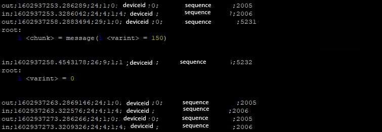

# Network analysis

Capture and analyze packets from vacuum to Cecotec cloud

## **Requirements**

- A rooted vacuum
- Cecotec cloud IP - You can got from config file
- [tcpproxy.py](https://github.com/ickerwx/tcpproxy) - An intercepting proxy for TCP data
- [tcpproxy.py personalized proxy module for Cecotec](https://gitlab.com/freeconga/stuff/-/tree/master/other)
- [protobuf-inspector](https://github.com/mildsunrise/protobuf-inspector/)
- [start-cloud-services.sh](https://gitlab.com/freeconga/stuff/-/tree/master/other)

## Procedure

1. Make cecotec folder in our computer

2. Inside cecotec folder, clone or download tcpproxy.py project, copy personalized proxy module from [other](https://gitlab.com/freeconga/stuff/-/tree/master/other) repository directory and paste under proxymodules folder.

3. Clone or download protobuf-inspector

4. Listening ports

`./tcpproxy.py -im CecotecIn -om CecotecOut -lp 4010 -li _yourComputerIP_ -tp 4010 -ti _CECOTECIP_ >> cecotec4010.log` 

`./tcpproxy.py -im CecotecIn -om CecotecOut -lp 4020 -li _yourComputerIP_ -tp 4020 -ti _CECOTECIP_ >> cecotec4020.log`

`./tcpproxy.py -im CecotecIn -om CecotecOut -lp 4050 -li _yourComputerIP_ -tp 4050 -ti _CECOTECIP_ >> cecotec4050.log`

5. Stop the vacuum executables (Monitor, everest-server, AuxCtrl, RobotApp, log-server), you can upload stop-vacuum-services.sh script to your vacuum

```
root@TinaLinux:~# /etc/init.d/robotManager stop
root@TinaLinux:~# kill -9 `pidof Monitor`
root@TinaLinux:~# kill -9 `pidof RobotApp`
root@TinaLinux:~# kill -9 `pidof AuxCtrl`
root@TinaLinux:~# kill -9 `pidof everest-server`
root@TinaLinux:~# kill -9 `pidof log-server`
``` 

6. Copy and execute start-cloud-services.sh in vacuum

## Finally

Read 3 logs files with tail in our computer

`tail -F cecotec4010.log cecotec4030.log cecotec4050.log`

