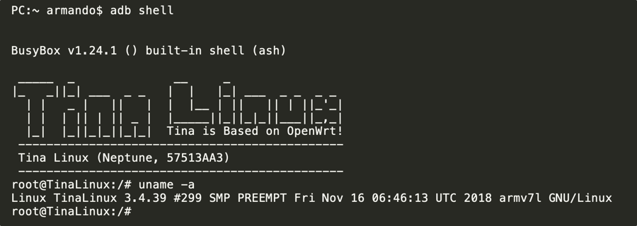

# Rooting the Cecotec Conga models 3290, 3390, 3490, 3590, 3690 & 3790

Good news for you: this particular model comes **already rooted from factory** (more or less). Here are the steps to get access to it and to make them permanent.

## Requirements

A Conga 3x90 model (of course!) and

**Method 1:** Via USB cable (recommended, easier):
* a USB to microUSB cable
* a computer with ADB installed

**Method 2:** SSH via WiFi network (-NOT- recommended):
* A WiFi network with internet access (preferably a private one, as data flies-by unencrypted)
* a computer with SSH installed
* The [Conga App](https://play.google.com/store/apps/details?id=es.cecotec.s3590) for these series

## Procedure

### Method 1 - USB cable (recommended)

1. Check that you have ADB tools installed and working in your computer (you can follow [this guide](https://www.xda-developers.com/install-adb-windows-macos-linux/))

2. Connect the USB cable to the Conga's frontal USB port

	

3. Open a terminal or console and execute the following command:

	> adb shell

	if you get a login prompt, type <code>root</code> and then the password <code>@3I#sc$RD%xm^2S&</code>

	if you already [patched your Conga](adb-without-password.md) before, no login or password is required

### Method 2 - SSH via WiFi network (-NOT- recommended)

1. Check that you have SSH installed and working in your computer (Linux/MacOS by default, use [Putty](https://www.chiark.greenend.org.uk/~sgtatham/putty/) in Windows)

2. You need to install the [Conga App](https://play.google.com/store/apps/details?id=es.cecotec.s3590) and connect your Conga to the Internet (following Cecotec's instructions). This is a bad idea as you're exposing your privacy... Unless you already did this before coming here, please, please, 🙏, use [Method 1](#method-1-usb-cable-recommended).

3. You have to find out the IP address of your Conga (see [this guide](https://techwiser.com/find-ip-address-of-any-device/) on how to)

4. Open an ssh connection to your Conga (change the 192.168.x.x for your Conga's IP address):
	> ssh root@192.168.x.x

	and when you get the login prompt, type <code>root</code> and then the password <code>@3I#sc$RD%xm^2S&</code>

### Finally
You should see something like this:

## Things that you can do now

* Change the password (to something non-default and secure 🙏)
* Add certificates to access via ssh without passwords
* Sniff network traffic inside the Conga itself
* Investigate all **the stuff** ... 😍
