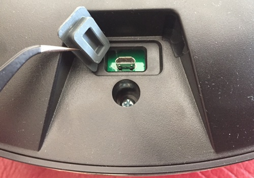

# Rooting the Cecotec Conga <br/> models 3090, 3290, 3390, 3490, 3590, 3690, 3790, 4090, 5490 & 6090

Good news for you: this particular model comes **already rooted from factory** (more or less). Here are the steps to get access to it and to make it permanent.

## Requirements

A Conga, of course! (3x90, 4090, 5490 or 6090 model) and

**Method 1:** Via USB cable (recommended, easier):
* a USB to microUSB cable
* a computer with ADB installed

**Method 2:** SSH via WiFi network (-NOT- recommended):
* A WiFi network with internet access (preferably a private one, as data flies-by unencrypted)
* a computer with SSH installed
* The Conga App:
	* [3090 Conga App](https://play.google.com/store/apps/details?id=es.cecotec.s3090v1) for 3090 model
	* [3x90 Conga App](https://play.google.com/store/apps/details?id=es.cecotec.s3590) for 3x90 series
	* [4000 Conga App](https://play.google.com/store/apps/details?id=es.cecotec.s4090) for 4090 model
	* [6090 Conga App](https://play.google.com/store/apps/details?id=es.cecotec.s6090) for 6090 model

## Procedure

### Method 1 - USB cable (recommended)

1. Check that you have ADB tools installed and working in your computer (you can follow [this guide](https://www.xda-developers.com/install-adb-windows-macos-linux/))

2. Connect the USB cable to the Conga's frontal USB port

	

3. Open a terminal or console and execute the following command:

	```bash
	PC:~ armando$ adb shell
	```

	if you get a login prompt, type <code>root</code> as user

	password may vary depending on your model:

	 - for 3090 and 6090: <code>3irobotics</code>[^1]
	 - for 3x90, 4090 & 5490: <code>@3I#sc$RD%xm^2S&</code>[^2]
	 


	if you already [patched your Conga](adb-without-password.md) before, no login or password is required


### Method 2 - SSH via WiFi network (-NOT- recommended)

1. Check that you have SSH installed and working in your computer (Linux/MacOS by default, use [Putty](https://www.chiark.greenend.org.uk/~sgtatham/putty/) in Windows)

2. You need to install the **Conga App** (see [above](#method-2-ssh-via-wifi-network-not-recommended) which one) and connect your Conga to the Internet (following Cecotec's instructions). This is a bad idea as you're exposing your privacy... Unless you already did this before coming here, please, please, 🙏, use [Method 1](#method-1-usb-cable-recommended).

3. You have to find out the IP address of your Conga (see [this guide](https://techwiser.com/find-ip-address-of-any-device/) on how to)

4. Open an ssh connection to your Conga (change the 192.168.x.x for your Conga's IP address):
	```bash
	PC:~ armando$ ssh root@192.168.x.x
	```

	and when you get the login prompt, type <code>root</code> and then the password depending on your model:

	 - for 3090: <code>3irobotics</code>[^1]
	 - for 3x90, 4090 & 5490: <code>@3I#sc$RD%xm^2S&</code>[^2]


### Finally
You should see something like this:


## Things that you can do now

* Change the password (to something non-default and secure 🙏)
* Add certificates (ssh key-pair) to [access via ssh without passwords](add-ssh-key.md)
* Sniff network traffic inside the Conga itself
* Investigate all **the stuff** ... 😍


## Notes:
[^1]: Model 3090 original password hash &rarr; <code>$1$ZnE1NgOT$oWafIj8xgsknzdJmRZM9N/</code> == <code>3irobotics</code>
[^2]: Model 3x90 original password hash &rarr; <code>$1$trVg0hig$L.xDOM91z4d/.8FZRnr.h1</code> == <code>@3I#sc$RD%xm^2S&</code>
